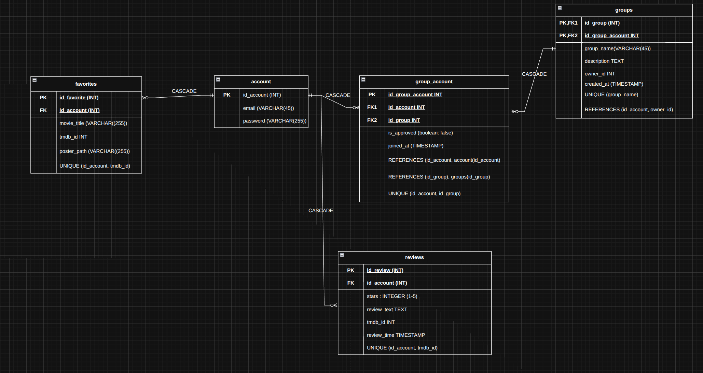
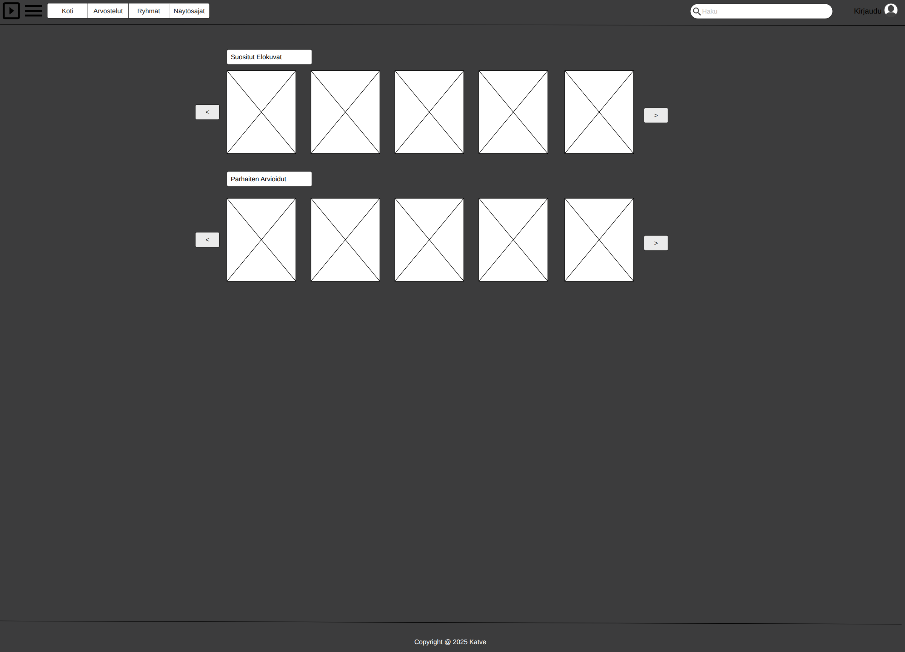
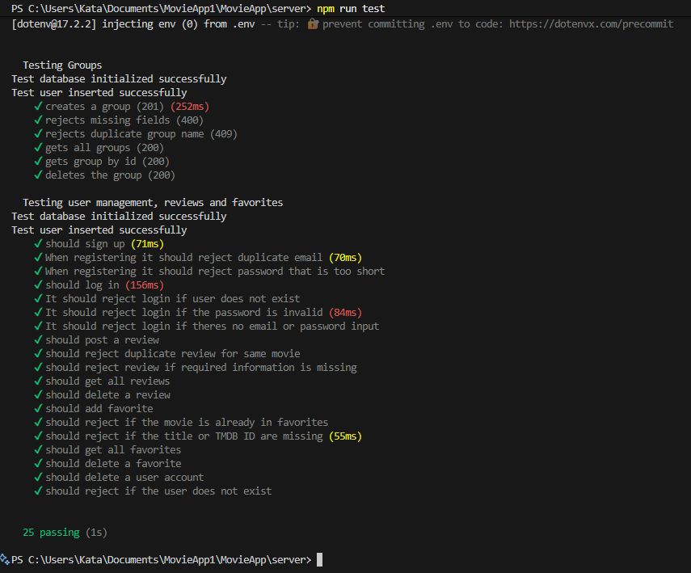

# Katve MovieApp project 🎬

 A student project for fullstack movie enthuasist app, built with React and NodeJS using a PostgreSQL database.

 The app is deployed on Render and will be available for about one month as of 10.10.2025:

[Render LINK](https://movieapp-front-6ute.onrender.com)

## Features

- 🔐 **Full Authentication System**
  - User registration and login with JWT tokens
  - Refresh token rotation for security
  - Password validation (8+ chars, 1 uppercase or number)
  - Protected routes

- 🎬 **Movie Discovery**
  - Browse popular and top-rated movies with carousels
  - Search with real-time results
  - Browse movie shotimes from different Finnkino theatres.

- 📚 **Movie Reviews**
    - Search for movies and write reviews. 
    - Only authenticated users can write a review but everyone can browse them

- ⭐ **Favorites**
  - Add movies to your favorites and share the list with anyone.

- ⭐ **Group functionality**
    - Authenticated users can create a groups or join already created groups.
    - Group owner can accept or decline members. 
    - Group member can also remove members from the group or delete the whole group.

## Tech Stack

- **Framework**: React with NodeJS/Express
- **Language**: JavaScript
- **Styling**: Custom made CSS
- **Database**: PostgreSQL
- **Authentication**: JWT with refresh token rotation
- **APIs**:
  - The Movie Database (TMDB) for movie data
- **Security**: bcrypt password hashing, httpOnly cookies

## Project documentation

### ER-diagram

### UI Moqup (frontpage)
- More can be found in repositorys /documents folder

### Automated testing
- Automated backend tests were done with Mocha -library.
- Testing were done to: groups, users, reviews and favorites features.

### REST-documentation
- API documentation were done using Postman and documentation can be found in:
[REST-documentation](https://documenter.getpostman.com/view/40326651/2sB3QJQBUg)

## Developed by
- Ville-Pekka Alavuotunki
- Kata Niva
- Aapo Pähti
- Emma Takkinen
- Tuure Väänänen
